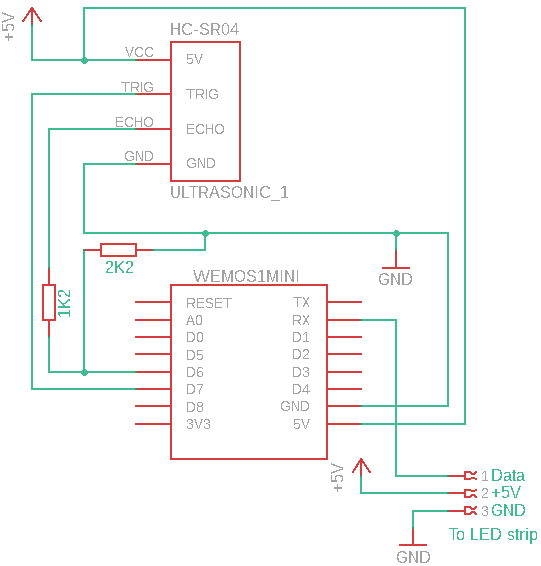

# Landing Lights
This is a simple project that uses an ESP8266, HCSR04 ultrasonic sensor and a strip of WS2812B LEDs to produce a garage parking sensor.
As you drive towards the garage wall, the LEDs slowly go out and change from green to yellow then red as you get closer.  Eventually, 
the entire LED strip flashes red - indicating that it really is time to stop.

The code also includes over-air-update capability.

## Parts List
- Wemos D1 mini
- HC SR04 Ultrasonic sensor
- WB2812B LED strip (1m, 60 LEDs)
- USB Power Supply

## Building The Code
I've used Visual Studio Code and Platformio, but this will work equally well with the Arduino IDE.

### Install The Libraries
Only two additional libraries are required:
- FastLED
- xxtea-lib

FastLED is required to drive the LED strip, and xxtea-lib is used to provide some protection for your wifi details.

### Configure Wifi Access
A template wifi config file is provided.  This file will eventaully contain your encrypted wifi details.  Firstly copy the `include/wifiConfig.tmp`l file to `include/wifiConfig.h`, edit it and add the following detials:

- `SSID` - The SSID of your wifi network
- `WIFI_PASSWORD` - The access password
- `ENCRYPTION_KEY` - A key to encrypt your wifi data with.  This is just a random string of data, it can be anything up to 50 characters.

When this is done, you can build and download the code to your Wemos.  Monitoring the serial port as it boots up, you will see that it is printing out the encrypted versions of your wifi data, something like this:

`--Encrypted SSID: 16AFE84BD198AAD3543DBA` 
`--Encrypted password: 991888FBBAECE5DAE1426DFBC871635DA41D4BD8FFBD44AE112DAE163`

Copy this data and replace your originals in `include/wifiConfig.h`, and change `GENERATE_ENCRYPTED_WIFI_CONFIG` to be 0.

If you build and download again, you should see your Wemos connect to you wifi network.

`Ready` 
`IP address: 192.168.1.100` 
`Distance: 0`

## Wiring It Up

It may look a bit odd that the RX line from the Wemos is going to the LED data line.  This is simply because I decided to use GPIO3, which is labelled RX on the Wemos PCB.

